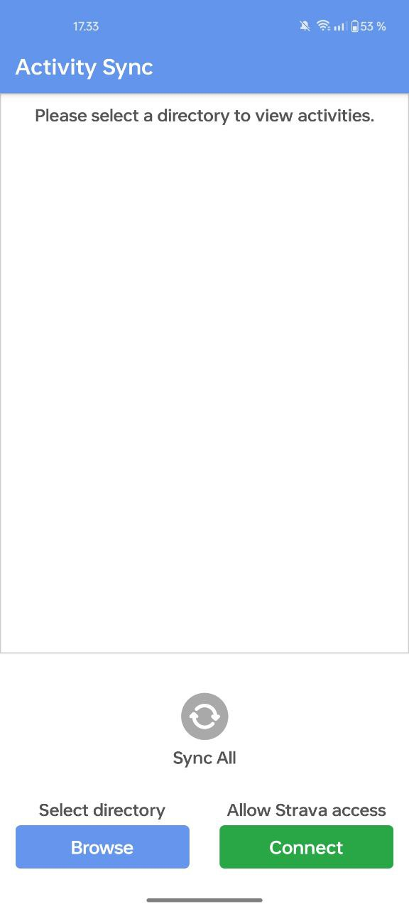
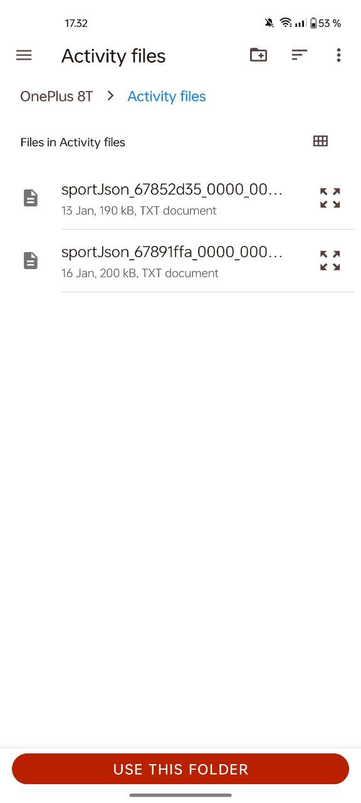
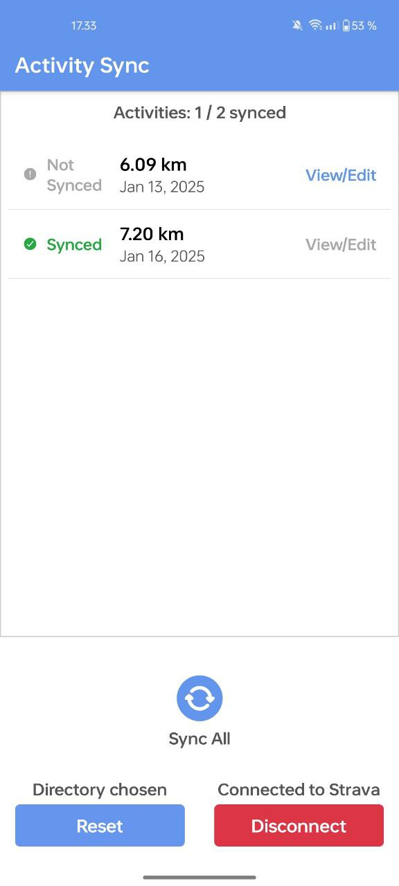

# **Activity Sync App**

A React Native app for syncing activity data from the OnePlus Health app with Strava, built using Expo, TypeScript, and FastAPI.

<table>
  <tr>
    <td></td>
    <td></td>
    <td></td>
    <td></td>
  </tr>
</table>

---

## **Table of Contents**

1. [Features](#features)
2. [Installation](#installation)
   - [Expo Setup](#expo-setup)
   - [Building the APK](#building-the-apk)
3. [Usage](#usage)
4. [Architecture](#architecture)
5. [Technologies Used](#technologies-used)
6. [Testing](#testing)
7. [Future Improvements](#future-improvements)
8. [License](#license)

---

## **Features**

- Strava OAuth authentication.
- Upload activity data to Strava in GPX format.
- Render activities on a map using React Native Maps.
- Manually adjust the route on the interactive map using Mapbox APIs.
- Keep track of the sync status of the activities.

---

## **Installation**

### **Expo Setup**

1. Clone the repository:
   ```bash
   git clone git@github.com:toukka1/Activity-sync-app.git
   cd activity-sync-app
   ```

2. Install dependencies:
   ```bash
   yarn install
   ```

3. Set up environment variables:  
Create a `.env` file in the root directory with the following variables:
   - EXPO_PUBLIC_GOOGLE_MAPS_API_KEY= your-api-key
   - EXPO_PUBLIC_STRAVA_CLIENT_ID=your-client-id
   - EXPO_PUBLIC_MAPBOX_ACCESS_TOKEN=your-mapbox-token

4. Start the expo app:
```bash
yarn run start
```

5. Run the backend:  
Follow the instructions in the [backend repository](https://github.com/toukka1/Activity-sync-app-backend) to set up the server.

6. Test the app on Expo Go:  
Scan the QR code generated by `yarn run start` using the Expo Go app on your mobile device.

---

### **Building the APK**

1. Install Expo Application Services (EAS CLI):
```bash
npm install -g eas-cli
```

2. Configure `eas.json` for your project:  
See [Expo’s documentation](https://docs.expo.dev/build/introduction/) for details.

3. Build the APK:
```bash
yarn eas build --platform android
```

4. Download the APK:  
Once the build is complete, download the APK from the Expo dashboard.

---

## **Usage**

1. Copy Oneplus Health activity files to a non-private directory in the device.
2. **Authenticate** with Strava to sync your activity data.
3. Select the working folder which contains the Oneplus Health app activities.
4. View and edit activities **on an interactive map**.
5. Sync individual activities or all activities with Strava.

---

## **Architecture**

### **Frontend**

**Key Components**:
- `ActivityList` and `ActivityListItem`: Display uploaded activities.
- `MapScreen`: Renders activities using React Native Maps.
- `DirectorySelection`: Handles file browsing.
- `SyncButton`: Initiates data upload to Strava.

### **Backend**

The backend API handles Strava OAuth token exchange. Built using FastAPI.

For setup, visit the [backend repository](https://github.com/toukka1/Activity-sync-app-backend).

---

## **Technologies Used**

### **Frontend**

- React Native (Expo)
- TypeScript
- React Native Maps
- Mapbox APIs
- Expo Secure Store (token storage)
- AsyncStorage (activity id caching)

### **Backend**

- Python
- FastAPI

---

## **Testing**

The app includes few sample unit tests to validate activity utilities.

Run tests with:
```bash
yarn run test
```

Coverage reports are available in the `coverage/` directory.

---

## **Future Improvements**

- Extend testing. Currently only sample unit tests.
- Improve error handling.
- Integrate with Shizuku API. Accessing the Oneplus Health app activity directory requires root level read access, which can be provided with Shizuku without rooting the device. Currently user is required to manually move the activity files using a third party file manager (e.g. Google Files) to a directory accessible by other apps.

---

## **License**

This project is licensed under the [MIT License](./LICENSE).

---
